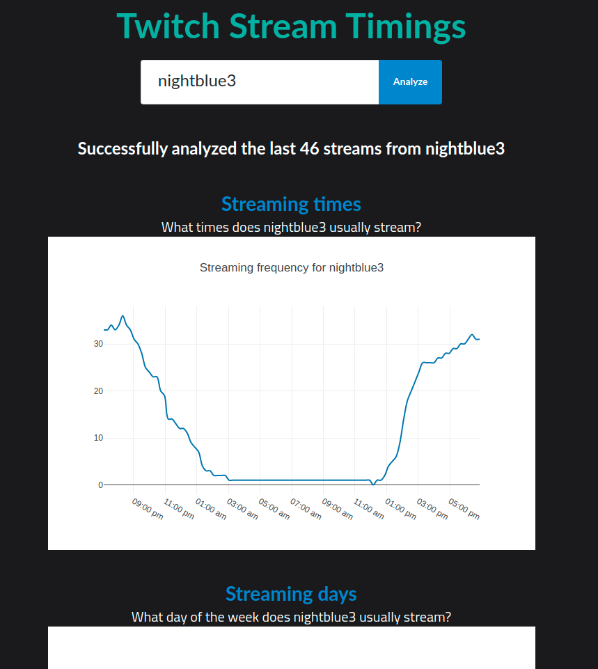
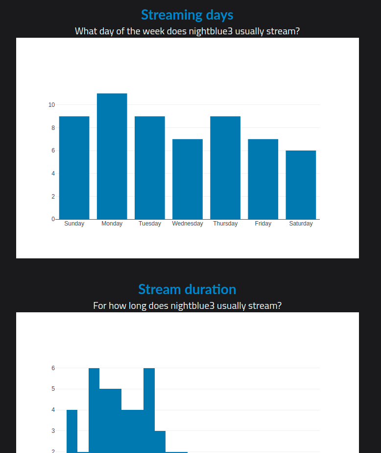
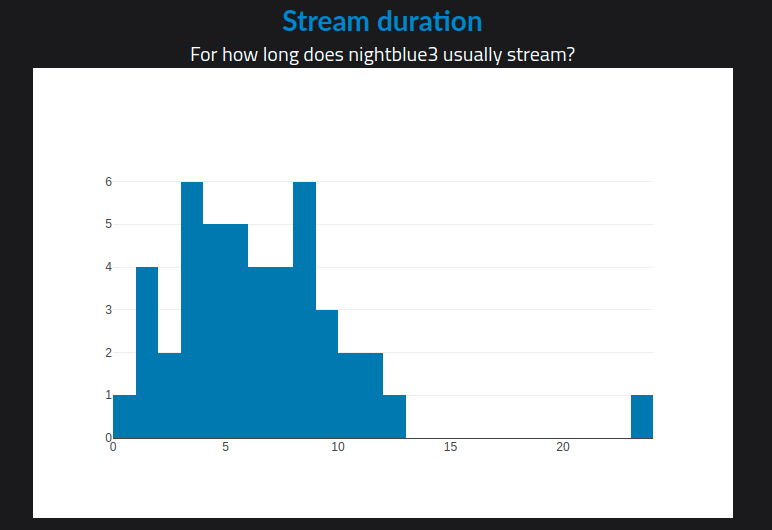

# Twitch Timings
This is a website and JSON API built to help people see what time twitch.tv streamers tend to stream most often.

The tech stack is Golang for the backend and React for the frontend.

Mux is used as the router on the backend.
On the frontend React plotly is used for drawing the plots and Moment.js is used for date/time calculations.

# Screenshots
Top of page:

Middle of page::

Bottom of page:

### TODO
1. Use Redis to cache requests to the twitch.tv API, otherwise this will easily go over the twitch API rate limits.
2. API should return UTC times instead of the computed histogram buckets so that datetime calculations can use the user's locale/timezone instead of the servers.
